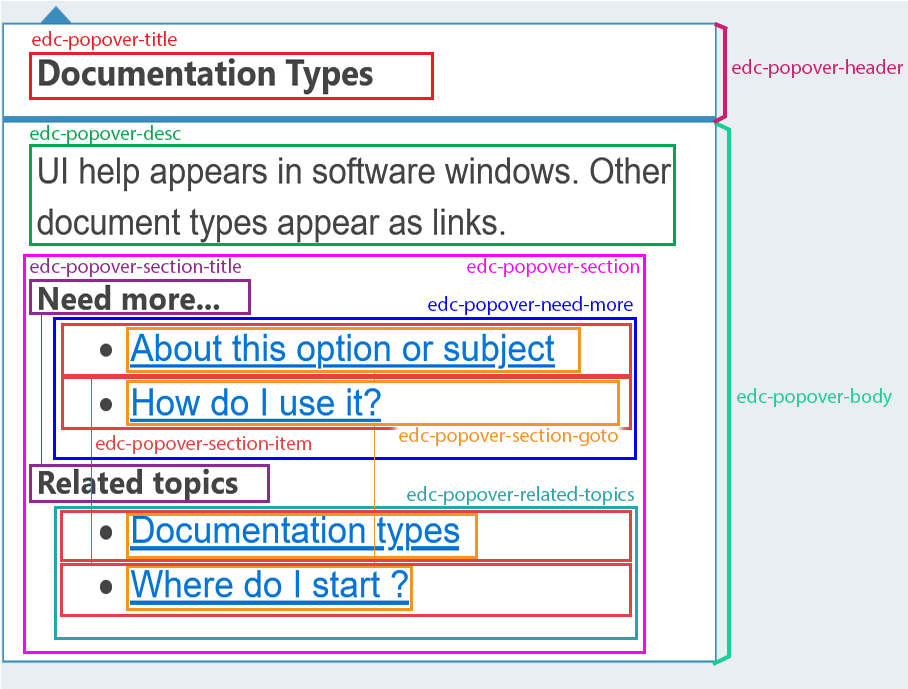

## edc-popover-js

[](https://travis-ci.org/tech-advantage/edc-popover-js)
[](https://badge.fury.io/js/edc-popover-js)

`edc-popover-js` is a javascript library for displaying the edc contextual help content.

_The project is part of **easy doc contents** [(edc)](https://www.easydoccontents.com)._

edc is a simple yet powerful tool for agile-like documentation management.

Learn more at [https://www.easydoccontents.com](https://www.easydoccontents.com).

## Dependencies

Peer dependencies:
for a ready-to-use solution for the icons:
- [FontAwesome](https://github.com/FortAwesome/Font-Awesome/tree/master/js-packages/%40fortawesome/fontawesome-free)


## How to use

### Import

You can import this module with `npm` by running:
```bash
npm install edc-popover-js --save
```

Or with `yarn`:
```bash
yarn add edc-popover-js
```
Then import the style files:

```
import 'edc-popover-js/dist/edc-popover.css';
```
For the default icons, you'll need to import [font-awesome](https://github.com/FortAwesome/Font-Awesome/tree/master/js-packages/%40fortawesome/fontawesome-free)
```
$ npm i --save @fortawesome/fontawesome-free
```

`yarn`

```
$ yarn add @fortawesome/fontawesome-free
```
Then import the styles in your application:
```css
import '@fortawesome/fontawesome-free/css/all.min.css';
```

Or you can use another library for the icons - see below for the available options.


### Setup

Provide a [edc configuration object](./src/config/edc-popover-configuration.ts) with the static `Popover.config(myEdcConfig)` method.

The configuration object has the following properties: 

| Attribute | Type | Description | Mandatory / default value |
|---|---|---|---|
| pluginId | string | The identifier of the target plugin documentation export | yes |
| helpPath | string | The path to edc-help-ng application | `help` |
| docPath  | string | The path to exported documentation | `doc` |
| i18nPath | string | The path to translation json files | `doc/i18n` |
| options | [IEdcPopoverOptions](./src/class/edc-popover-options.interface.ts) | Options for the popover | no |

Example : 
```javascript
const edcConfig = {
    pluginId: 'edc',
    docPath: '/doc',
    helpPath: 'https://demo.easydoccontents.com/help',
    i18nPath: './doc/i18n',
    /* you can define global options here options: { placement: 'left', ..... }
    {
      placement: 'bottom'
     }
     */
};
EdcPopover.config(edcConfig);
```


### Creating popovers

#### Instantiating a group of popovers

Add the class `edc-help` class to every parent element of a edc help popover.

Note that the mandatory `data-main-key` and `data-sub-key` attributes need to be defined for each element.

```html
<div class="edc-help" data-main-key="one.main.key" data-sub-key="one.sub.key"></div>
...

<div class="edc-help" data-main-key="one.main.key" data-sub-key="another.sub.key"></div>
```

Calling the `Popover.createAll()` will create a popover for each element with this class.

```javascript
Popover.createAll();
```

If you want to use another class, pass it as a first argument.

```javascript
Popover.createAll('specific-class-name');
```
You can also specify popover properties for the whole group as a second argument.

```javascript
// These options will override the ones defined with the configuration for those popovers
const options = {
	trigger: 'mouseenter'
};
Popover.createAll('specific-class-name', { options });
```
#### Instantiating one popover passing the reference of the element
Considering you have defined in the dom the following elements

```html
<div id="popover1"
 data-main-key="one.main.key"
 data-sub-key="first.sub.key"
 data-lang="it"
 data-options='{ "trigger": "mouseenter" }'>
</div>
<div id="popover2"></div>
```
You can create the popover passing the reference of one specific element

```javascript
const popover1 = document.getElementById('popover1');
Popover.create(popover1);

const props = {
	mainKey: 'help.center',
    subKey: 'settings',
	options: {
    	animation: 'shift-away'
    }
};
// Popover properties passed as second arguments - they will override any property defined  in the html
Popover.create(document.getElementById('popover2'), props);
```

## Inputs and options

#### Mandatory inputs
Mandatory inputs:

| Prop | Type | Description |
|---|---|---|
| mainKey | `string` | The main key of the contextual help |
| subKey | `string` | The sub key of the contextual help |


#### Optional inputs
Optional inputs for the component:

| Input Name | Return type | Description | Default value |
|---|---|---|---|
| pluginId | `string` | A different pluginId from the one defined in the main service | `undefined` |
| lang | `string` | The language to use, for labels and contents, identified by the 2 letters from the [ISO639-1](https://en.wikipedia.org/wiki/List_of_ISO_639-1_codes) standard. Will use documentation's default if no value is provided  | `undefined` |
| options | [EdcPopoverOptions](./src/class/edc-popover-options.ts) | Options for this popover - will overwrite global options | `undefined` |

Available options [(EdcPopoverOptions)](./src/class/edc-popover-options.ts):

| Property | Type | Description | Default |
|---|---|---|---|
| icon | `PopoverIcon` | Icon settings, see [Icon](#Icon) | [PopoverIcon](./src/class/popover-icon.ts) |
| failBehavior | `FailBehavior` | Icon and popover behavior on error, see [Fail Behavior](#fail-behavior)  | [FailBehavior](./src/class/fail-behavior.ts) |
| placement | popper.js `Placement` | Popover positioning relatively to the icon | `bottom` |
| hideOnClick | `boolean` | If true, any click outside of the popover will close it (inside too if interactive is false) | `true` |
| interactive | `boolean` | Determine if we can interact with the popover content | `true` |
| trigger | `string` | Event that will trigger the popover: `click` `mouseenter` `focus` | `click` |
| customClass | `string` | class name that will be added to the main popover container | undefined |
| dark | `boolean` | Dark mode | `false` |
| theme | `string` | Popover's theme name | `undefined` |
| displayPopover | `boolean` | Show the popover / Go directly to the web help viewer on click | `true` |
| displaySeparator | `boolean` | Show / Hide the separator between header and body | `true` |
| displayTitle | `boolean` | Show / Hide the header containing the title | `true` |
| displayArticles | `boolean` | Show / Hide the articles section | `true` |
| displayRelatedTopics | `boolean` | Show / Hide the related Topics (aka Links) section | `true` |
| displayTooltip | `boolean` | Show / Hide the icon tooltip | `true` |
| delay | `number | [number, number]` | Delay in milliseconds before showing the popover - if array, delay for opening and closing respectively | `undefined` |
| animation | `Animation` | Animation when opening / closing the popover | `undefined` |
| appendTo | `'parent' | Element | (() => Element)` | The element to which append the popover to | `(() => documentation.body)` |

#### Icon
[PopoverIcon](./src/class/popover-icon.ts) contains the options for the icon.

| Property | Type | Description | Default |
|---|---|---|---|
| class | `string` | Class name for the icon. [Font awesome icon classes](https://fontawesome.com/v4.7.0/cheatsheet/) are handled natively | `'fa fa-question-circle-o'` |
| url | `string` | Image url, size is determined by height, and width properties | `undefined` |
| height | `number` | Image height in pixels (for url images only) | `18` |
| width | `number` | Image width in pixels (for url images only). Will take height value if none is provided | `18` |

If `class` property is provided, it will overwrite the default class `'fa fa-question-circle-o'`.
If `url` is defined, it will override the class property, even if `class` is defined.

####Fail Behavior
If the help content failed to be loaded - or any other error occurred, the icon and the popover will look for the [FailBehavior](./src/class/fail-behavior.ts) options to define their style and content.

There are separate behaviors for the help icon, and the popover itself.

For the help icon when an error occurs, it adds the following css selector.
 
| Behavior | Description | CSS selector |
|---|---|---|
| `SHOWN` | The help icon is shown as usual (default) | `.edc-help-icon` |
| `DISABLED` | The help icon is greyed out | `.edc-icon-disabled` |
| `HIDDEN` | The help icon is completely hidden (but stays in DOM to avoid breaking the UI) | `.edc-icon-hidden` |
| `ERROR` | The help icon is replaced by an exclamation point | `.edc-icon-error` |

Default values are in file [style.less](./src/style.less)

For the popover when an error occurs:
 - `ERROR_SHOWN` An error message is shown in the popover
 - `FRIENDLY_MSG` A friendly and translated message is shown in the popover
 - `NO_POPOVER` No popover appears when the help icon is triggered

By default, the icon is `SHOWN` and the popover is set to `FRIENDLY_MSG`.

## Customization

### CSS

#### Global

When dark-mode is enabled, the CSS class `edc-on-dark` is applied to the help icon.

#### Popover

You can customize the popover with CSS classes as described below :



For more control, the `customClass` option will add the given class name to the popover container `.edc-popover-container`.
You can then override the main classes.

For example, if you'd like to change the background color of the popover
```css
.my-custom-class {
    background-color: lightgreen;
}
/* or the title font-size */
.my-custom-class .edc-popover-title {
    font-size: 18px;
}
```

## Providing your own translations for the popover labels

You can set additional translations (or replace the existing ones) by adding i18n json files to the documentation folder.

Please note that one file is required per language (see file example below), and should be named following the ISO639-1 two letters standards 
(ie en.json, it.json...).

By default, edc-popover-js will be looking for the files in [yourDocPath]/popover/i18n/ (*.json), but you can change this path by modifying 
getI18nPath() in your PopoverConfigurationHandler.

edc-popover-js comes with English and French translations, and supports up to 36 languages.
For the full list, please refer to [LANGUAGE_CODES](./src/translate/language-codes.ts).

##### JSON file structure

Here is the en.json file used by default:

```json
{
  "labels": {
  "articles": "Need more...",
  "links": "Related topics",
  "iconAlt": "Help",
  "comingSoon": "Contextual help is coming soon.",
  "errorTitle":  "Error",
  "errors": {
    "failedData": "An error occurred when fetching data !\nCheck the brick keys provided to the EdcHelp component."
  },
  "content": null,
  "url": "",
  "exportId": ""
  }
}
```
